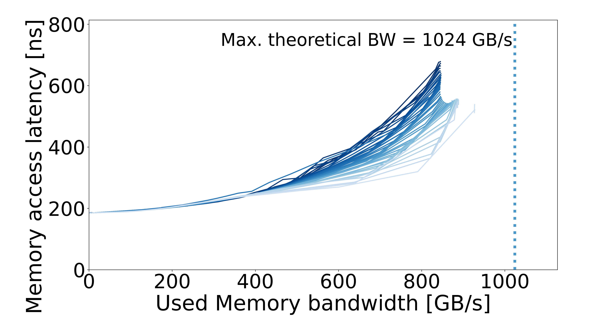
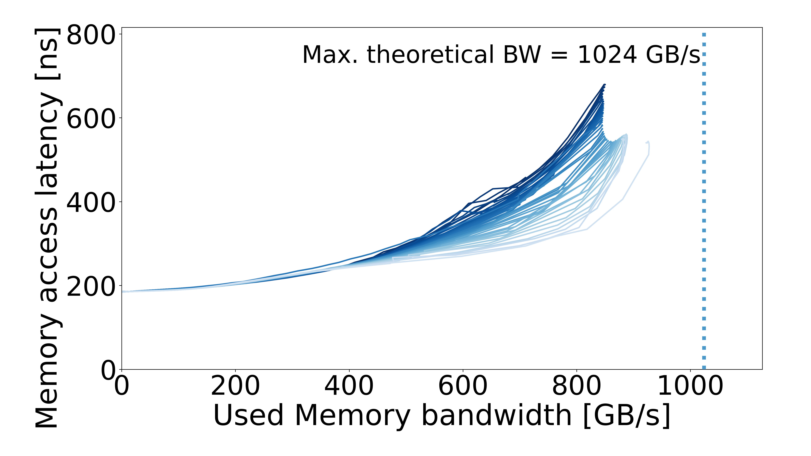
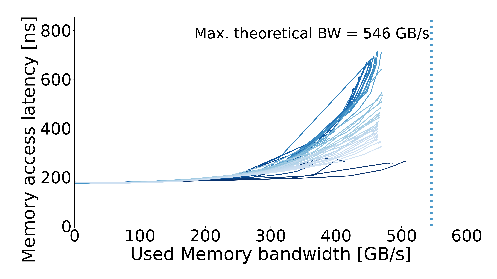
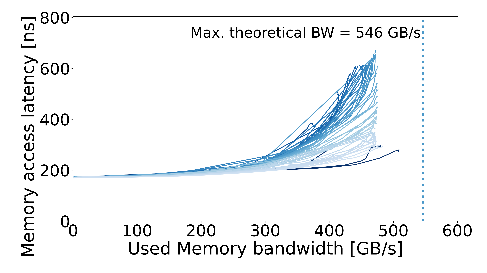
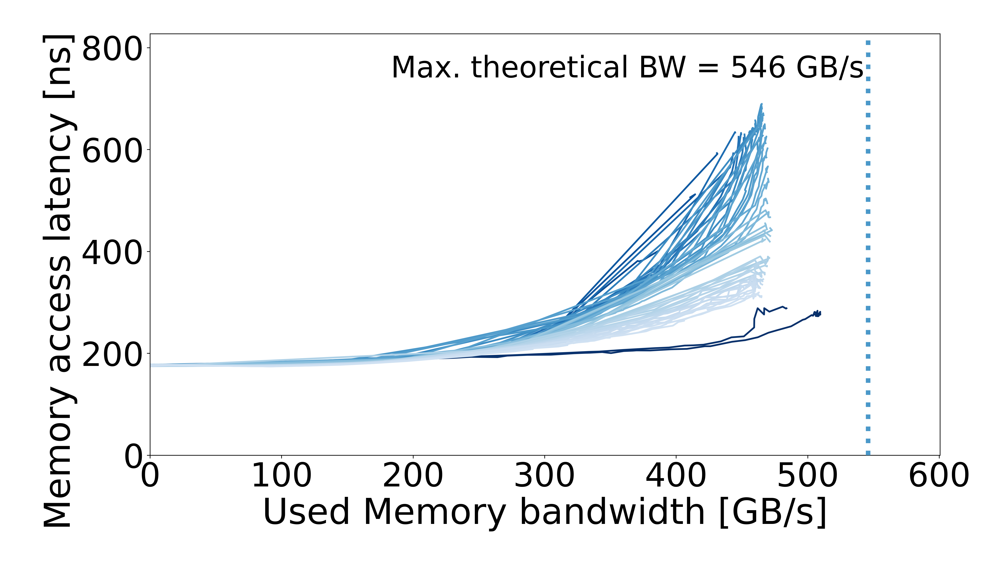
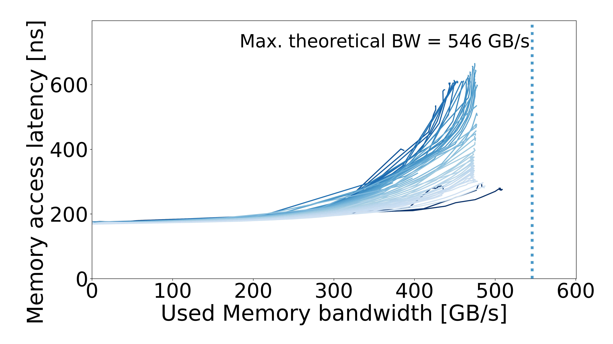
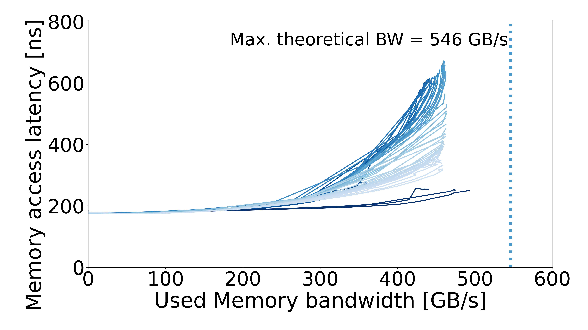

<h1>Mess Results</h1>

Measured memory bandwidth–latency curves for consumer and HPC systems.

<a href="#consumer-curves">Consumer curves</a> · <a href="#hpc-curves">HPC curves</a> · <a href="#system-index">System index</a> · <a href="#using-the-results">Using the results</a>

| Configurations | Systems | Consumer | HPC |
| :---: | :---: | :---: | :---: |
| **38** | **17** | 8 configurations | 30 configurations |

Results measured with [Mess](https://github.com/bsc-mem/Mess). Click a curve for recorded machine specs and PDF, CSV, and JSON downloads.

## System index

### Consumer

| System | Available configurations |
| --- | --- |
| [AMD Ryzen 7 5700X3D](#consumer-amd-ryzen-7-5700x3d) | Default |
| [Apple MacBook Air M1](#consumer-apple-m1-base-macbook-air) | M1 · MacBook Air |
| [Apple MacBook Air M2](#consumer-apple-m2-base-macbook-air) | M2 · MacBook Air |
| [Intel Core i5-8600K](#consumer-intel-core-i5-8600k) | 2133 MT/s · 16 GB; 2666 MT/s · 8 GB; 3200 MT/s · 16 GB |
| [Intel Core i7-1185G7](#consumer-intel-core-i7-1185g7) | 3733 MT/s · 16 GB |
| [Intel Core i7-1265U](#consumer-intel-core-i7-1265u) | Default |

### HPC

| System | Processor | Available configurations |
| --- | --- | --- |
| [CTE-AMD](#hpc-cte-amd) | AMD EPYC 7742 | DDR4 |
| [Intel-CLX](#hpc-intel-clx) | Intel Xeon Gold 5218 | DDR4 |
| [Fugaku](#hpc-fugaku) | Fujitsu A64FX | NEON · SVE |
| [NVIDIA Grace](#hpc-nvidia-grace) | NVIDIA Grace | Scalar · NEON Native / Pair · SVE / SVE128 / SVE Max |
| [Intel-EMR](#hpc-intel-emr) | Xeon Platinum 8568CXL | DDR5 · Prefetch on / off |
| [Intel-GNR](#hpc-intel-gnr) | Xeon 6980P | RDIMM · AVX2 / AVX512; MRDIMM · AVX2 |
| [Jülich](#hpc-julich) | Intel Xeon Max 9462 | DDR5 · HBM |
| [MN5 ACC](#hpc-mn5-mn5-acc-cpu) | Intel Xeon Platinum 8460Y+ | DDR5 |
| [MN5 ACC](#hpc-mn5-mn5-acc-gpu) | NVIDIA H100 | H100 |
| [MN5 GPP](#hpc-mn5-mn5-gpp) | Intel Xeon Platinum 8480+ | Regular / highmem · AVX2, AVX512, Scalar, SSE |
| [MN5 HBM](#hpc-mn5-mn5-hbm) | Intel Xeon Max 9480 | HBM · DDR5 · SNC DDR5 |

## Consumer curves

[Browse folders](Systems/Consumer/README.md) · [System index](#system-index)

### AMD Ryzen

#### AMD Ryzen 7 5700X3D

**3200 MT/s**

### Apple Silicon

#### Apple MacBook Air M1

**Default**

#### Apple MacBook Air M2

**Default**

### Intel Core

#### Intel Core i5-8600K

| 2133MTs-16GB | 2666MTs-8GB | 3200MTs-16GB |
| :---: | :---: | :---: |
|  |  |  |

#### Intel Core i7-1185G7

**3733MTs-16GB**

#### Intel Core i7-1265U

**Default**

## HPC curves

[Browse folders](Systems/HPC/README.md) · [System index](#system-index)

### CTE-AMD — AMD EPYC 7742

**DDR4 · 3200 MT/s**

### Intel-CLX — Intel Xeon Gold 5218

**DDR4 · 2933 MT/s**

### Fugaku — Fujitsu A64FX

| NEON | SVE |
| :---: | :---: |
|  |  |

### NVIDIA Grace

| SCALAR | NEON_NATIVE | NEON_PAIR |
| :---: | :---: | :---: |
|  |  |  |

| SVE | SVE128 | SVE_MAX |
| :---: | :---: | :---: |
|  |  |  |

### Intel EMR — Xeon Platinum 8568CXL

| DDR / prefetch off | DDR / prefetch on |
| :---: | :---: |
|  |  |

### Intel GNR — Xeon 6980P

| MRDIMM / AVX2 | RDIMM / AVX2 | RDIMM / AVX512 |
| :---: | :---: | :---: |
|  |  |  |

### Jülich — Intel Xeon Max 9462

| DDR5 | HBM |
| :---: | :---: |
|  |  |

### MN5 ACC — Intel Xeon Platinum 8460Y+

**DDR5 · 4800 MT/s**

### MN5 ACC — NVIDIA H100

**H100**

### MN5 GPP — Intel Xeon Platinum 8480+

| highmem / AVX2 | highmem / AVX512 |
| :---: | :---: |
|  |  |

| highmem / SCALAR | highmem / SSE |
| :---: | :---: |
|  |  |

| regular / AVX2 | regular / AVX512 |
| :---: | :---: |
|  |  |

| regular / SCALAR | regular / SSE |
| :---: | :---: |
|  |  |

### MN5 HBM — Intel Xeon Max 9480

| DDR5 | SNC / DDR5 | HBM |
| :---: | :---: | :---: |
|  |  |  |

## Using the results

- **CSV / JSON:** processed curve data for analysis and simulation.
- **PDF / PNG:** plots for viewing and reuse.
- **Units:** bandwidth in GB/s and latency in ns. Run READMEs document the machine and recorded configuration.

This collection contains multisequential results. Raw measurement logs are omitted to keep downloads compact.

## Contribute

Add a system or chip variant with [Mess](https://github.com/bsc-mem/Mess) results in CSV, JSON, PDF, and PNG. Include the machine model, chip, RAM capacity, OS, and run configuration in a short README.

## Citation

Please cite [A Mess of Memory System Benchmarking, Simulation and Application Profiling (MICRO 2024)](https://ieeexplore.ieee.org/document/10764561).

[Mess](https://github.com/bsc-mem/Mess) · [Mess Simulator](https://github.com/bsc-mem/Mess-simulator) · [Mess-Paraver](https://github.com/bsc-mem/Mess-Paraver)
