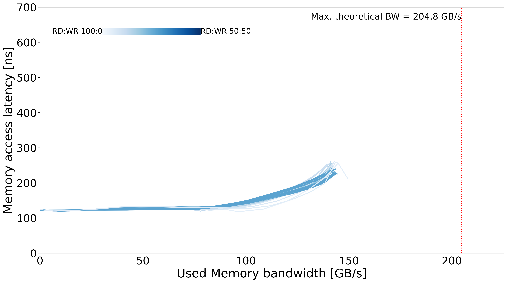

# CTE-AMD - DDR4

## System Overview

| Model | µArch | Sockets | Cores / Socket | Frequency (GHz) | Type | Freq (MT/s) | Channels / Socket |
| --- | --- | --- | --- | --- | --- | --- | --- |
| AMD EPYC 7742 | Zen 2 | 1 | 64 | 2.25 | DDR4 | 3200 | 8 |

## Memory Performance

### Local Memory
| Memory Curve |
| --- |
|  |
