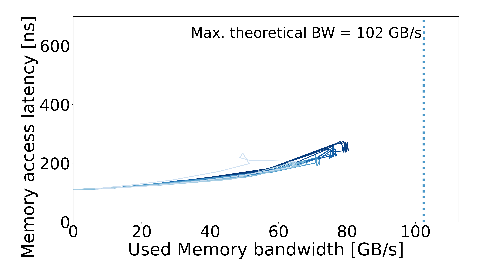

# Apple M2

Processor: **Apple MacBook Air M2**. Machine specs are documented in the configuration pages below.

| Configuration | Results |
| --- | --- |
| [Apple MacBook Air M2](MacBook-Air/README.md) | 1 configuration |

## Curves

| Configuration | Configuration | Configuration |
| :---: | :---: | :---: |
| **Default**  |  |  |

Contributions welcome: add Mess curves with the Mac model, chip, RAM capacity, OS, and run configuration.
