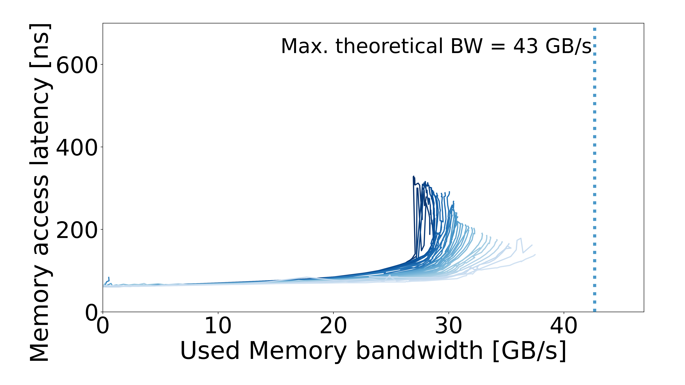

# Intel Core i5-8600K — 2666MTs-8GB

[System overview](../README.md) · [All systems](../../../../README.md)

## Recorded machine specs

| Field | Value |
| --- | --- |
| Machine / processor | Intel Core i5-8600K |
| RAM capacity | 8 GB |
| Access pattern | Multisequential |
| Configuration | 2666MTs-8GB |
| Plotter memory rate | 2667 MT/s |
| Plotter memory layout | 2 channels × 64 bits |
| Plotter CPU reference | 4.030486 GHz |
| OS / kernel | Not recorded |

Specs reflect the archived machine description and run inputs.

## Curve

[Files and downloads](processed/README.md)
