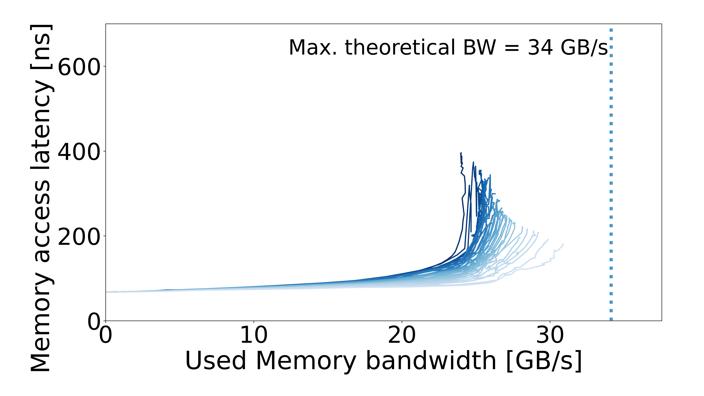
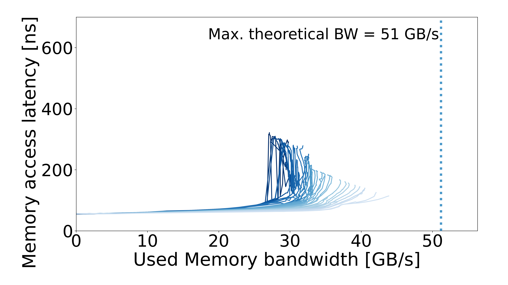

# Intel Core i5-8600K

## System specs

| Field | Value |
| --- | --- |
| Processor | Intel Core i5-8600K |
| RAM capacity | 16 GB / 8 GB |
| Plotter memory rate | 2133 MT/s / 2667 MT/s / 3200 MT/s |
| OS / kernel | Not recorded |

Archived CPU frequencies come from the machine description.

## Configurations

| Configuration | Results |
| --- | --- |
| [2133MTs-16GB](2133MTs-16GB/README.md) | 1 configuration |
| [2666MTs-8GB](2666MTs-8GB/README.md) | 1 configuration |
| [3200MTs-16GB](3200MTs-16GB/README.md) | 1 configuration |

## Curves

| 2133MTs-16GB | 2666MTs-8GB | 3200MTs-16GB |
| :---: | :---: | :---: |
|  |  |  |
