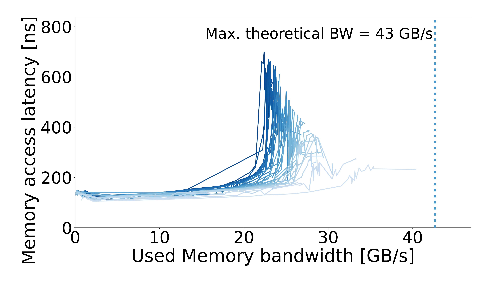

# Intel Core i7-1265U

[All systems](../../../README.md)

## Recorded machine specs

| Field | Value |
| --- | --- |
| Machine / processor | Intel Core i7-1265U |
| Access pattern | Multisequential |
| Configuration | Default |
| Plotter memory rate | 2666 MT/s |
| Plotter memory layout | 2 channels × 64 bits |
| Plotter CPU reference | 4.017227 GHz |
| OS / kernel | Not recorded |

Specs reflect the archived machine description and run inputs.

## Curve

[Files and downloads](processed/README.md)
