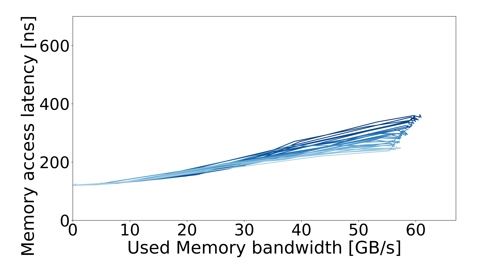
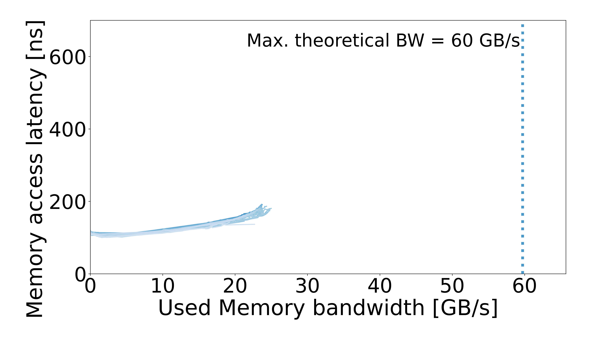

# Consumer systems

| System / configuration | Results |
| --- | --- |
| [AMD](AMD/README.md) | 1 configuration |
| [Apple](Apple/README.md) | 2 configurations |
| [Intel](Intel/README.md) | 5 configurations |

## Curves

| AMD Ryzen 7 5700X3D | Apple MacBook Air M1 |
| :---: | :---: |
|  |  |

| Apple MacBook Air M2 | Intel Core i5-8600K |
| :---: | :---: |
|  |  |

| Intel Core i5-8600K | Intel Core i5-8600K |
| :---: | :---: |
|  |  |

| Intel Core i7-1185G7 | Intel Core i7-1265U |
| :---: | :---: |
|  |  |
