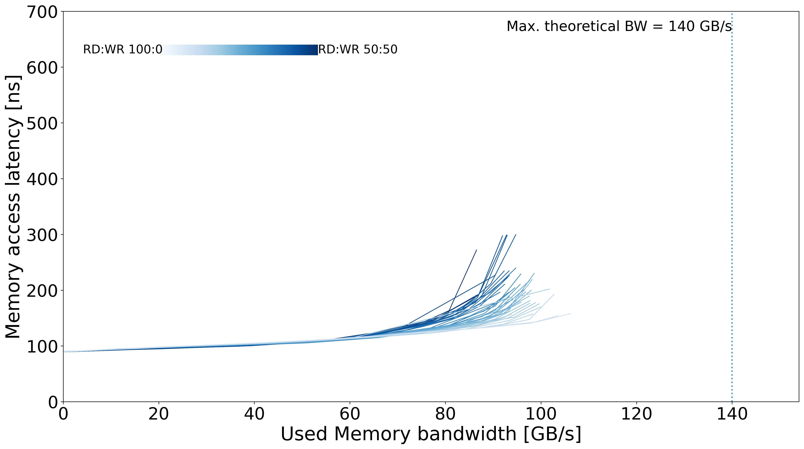

# EPEEC4 - DDR4

## System Overview

| Model | µArch | Sockets | Cores / Socket | Frequency (GHz) | Type | Freq (MT/s) | Channels / Socket |
| --- | --- | --- | --- | --- | --- | --- | --- |
| Intel Xeon Gold 5218 | Cascade Lake | 2 | 16 | 2.30 | DDR4 | 2933 | 6 |

## Memory Performance

### Local Memory
| Memory Curve |
| --- |
|  |
