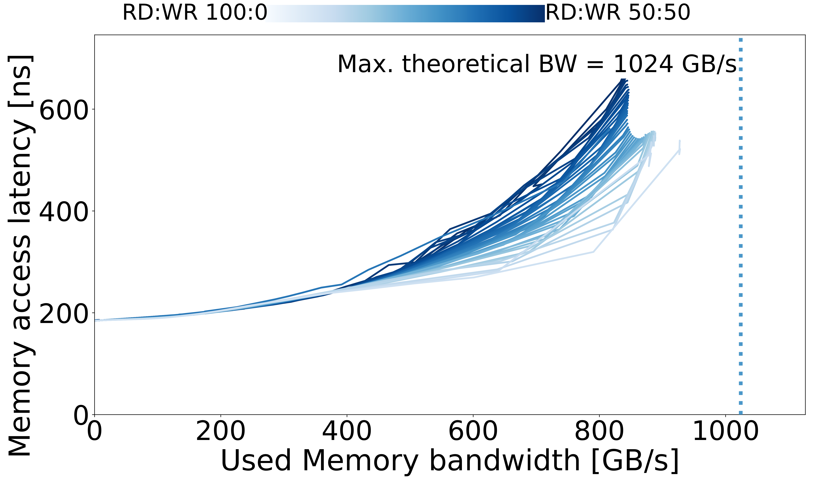
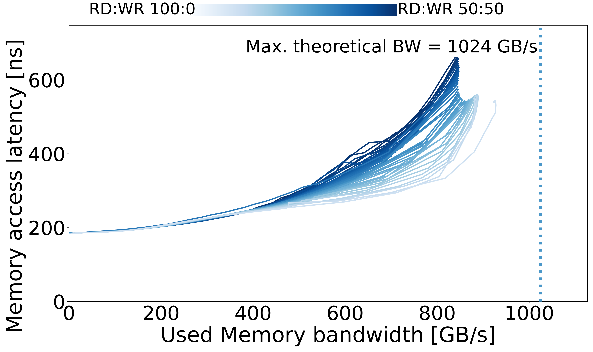

# Fugaku

## System Overview

| Model | µArch | Sockets | Cores / Socket | Frequency (GHz) | Type | Freq (MT/s) |
| --- | --- | --- | --- | --- | --- | --- |
| Fujitsu A64FX | A64FX | 1 | 48 | 2.0 / 2.2 | HBM2 | 1024 GB/s |

## Memory Performance

#### NEON

| Curve |
| --- |
|  |

#### SVE

| Curve |
| --- |
|  |