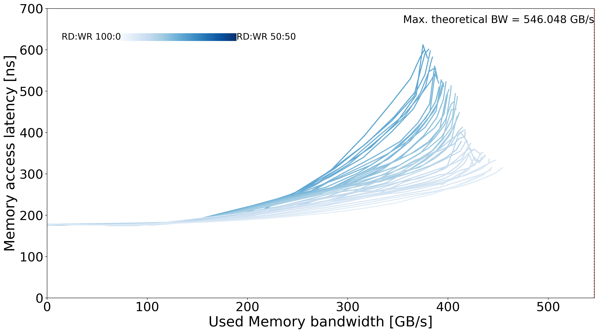

# MareNostrum 5 - NG-GRACE

## System Overview

| Model | µArch | Sockets | Cores / Socket | Frequency (GHz) | Type | Freq (MT/s) | Channels / Socket |
| --- | --- | --- | --- | --- | --- | --- | --- |
| NVIDIA Grace 72C | Grace | 2 | 72 | 3.1 | LPDDR5 | 4266 | 60 (per die) |

## Memory Performance

### Local Memory
| Memory Curve |
| --- |
|  |

