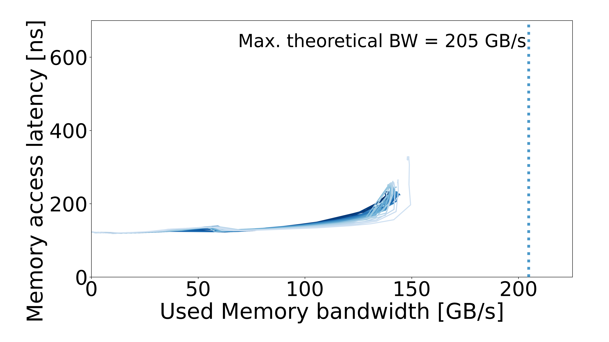

# CTE-AMD — AMD EPYC 7742

[All systems](../../README.md)

## Recorded machine specs

| Field | Value |
| --- | --- |
| Machine / processor | CTE-AMD — AMD EPYC 7742 |
| Archived CPU frequency | 2.25 GHz |
| Microarchitecture | Zen 2 |
| Sockets / cores per socket | 1 / 64 |
| Memory type | DDR4 |
| Access pattern | Multisequential |
| Configuration | Default |
| Plotter memory rate | 3200 MT/s |
| Plotter memory layout | 8 channels × 64 bits |
| OS / kernel | Not recorded |

Specs reflect the archived machine description and run inputs.

## Curve

[Files and downloads](processed/README.md)
