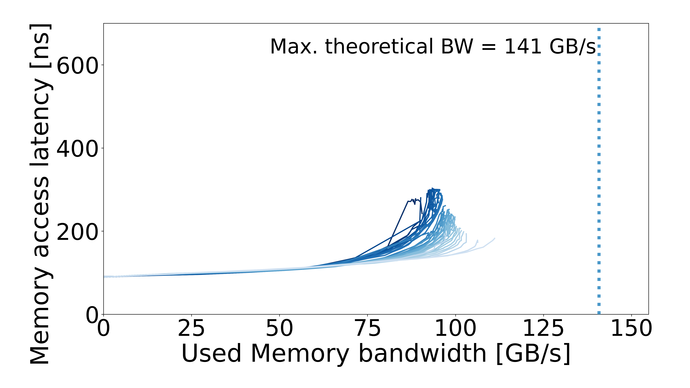

# Intel-CLX — Intel Xeon Gold 5218

[All systems](../../README.md)

## Recorded machine specs

| Field | Value |
| --- | --- |
| Machine / processor | Intel-CLX — Intel Xeon Gold 5218 |
| Archived CPU frequency | 2.30 GHz |
| Microarchitecture | Cascade Lake |
| Sockets / cores per socket | 2 / 16 |
| Memory type | DDR4 |
| Access pattern | Multisequential |
| Configuration | Default |
| Plotter memory rate | 2933 MT/s |
| Plotter memory layout | 6 channels × 64 bits |
| Plotter CPU reference | 2.779692 GHz |
| OS / kernel | Not recorded |

Specs reflect the archived machine description and run inputs.

## Curve

[Files and downloads](processed/README.md)
