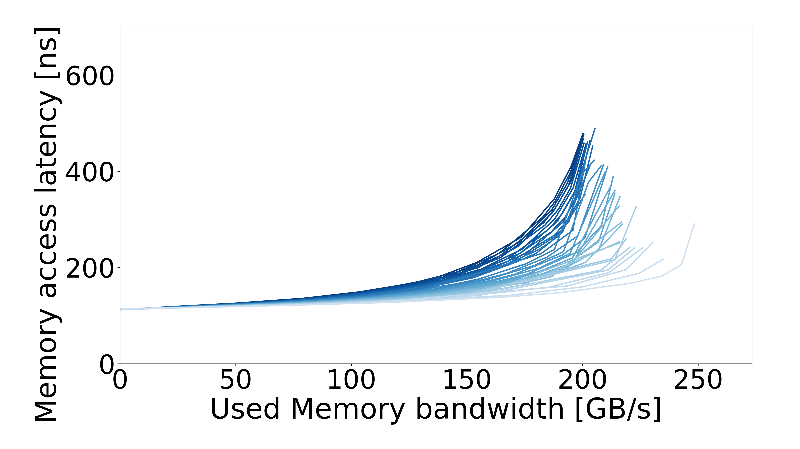

# DDR

Processor: **Intel EMR — Xeon Platinum 8568CXL**. Machine specs are documented in the configuration pages below.

| Configuration | Results |
| --- | --- |
| [prefetch-off](prefetch-off/README.md) | 1 configuration |
| [prefetch-on](prefetch-on/README.md) | 1 configuration |

## Curves

| DDR / prefetch off | DDR / prefetch on |
| :---: | :---: |
|  |  |
