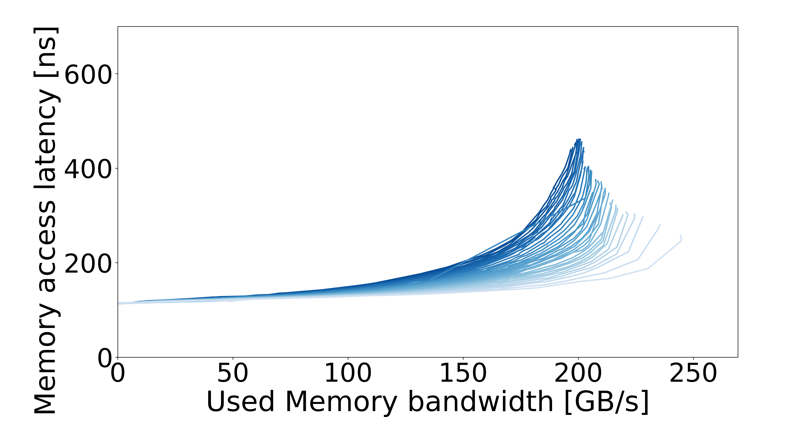

# Intel EMR — Xeon Platinum 8568CXL — DDR / prefetch off

[System overview](../../README.md) · [All systems](../../../../README.md)

## Recorded machine specs

| Field | Value |
| --- | --- |
| Machine / processor | Intel EMR — Xeon Platinum 8568CXL |
| Archived CPU frequency | 2 GHz |
| Microarchitecture | Emerald Rapids |
| Sockets / cores per socket | 2 / 48 |
| Memory type | DDR5 |
| Archived memory configuration | 4800 MT/s; 8 channels per socket |
| Access pattern | Multisequential |
| Configuration | DDR / prefetch off |
| OS / kernel | Not recorded |

Specs reflect the archived machine description and run inputs.

Curves were regenerated from archived CSV data.

## Curve

[Files and downloads](processed/README.md)
