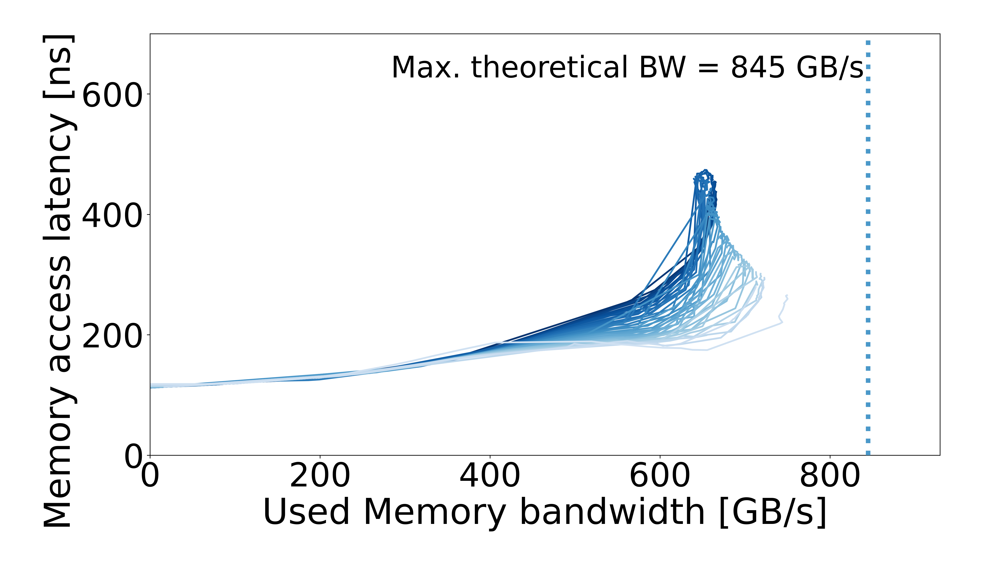

# Curve files

[Intel GNR — Xeon 6980P: run and machine specs](../README.md)

| File | Use |
| --- | --- |
| [CSV](memory_curves.csv) | Processed measurements |
| [JSON](memory_curves.json) | Curve coordinates for analysis and simulation |
| [PDF](memory_curves.pdf) | Vector plot |
| [PNG](memory_curves.png) | Plot preview |

Bandwidth: GB/s. Latency: ns.

