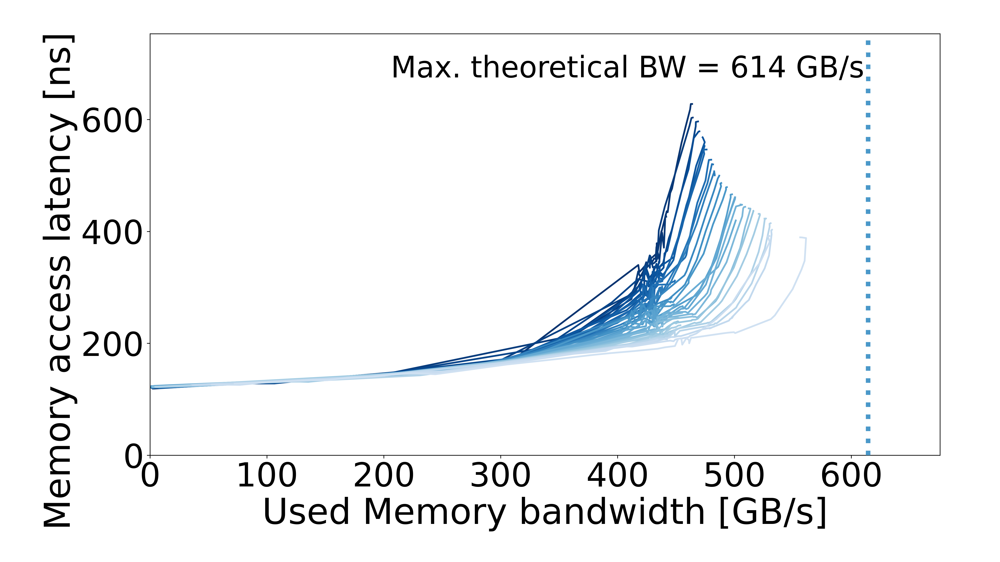

# Intel GNR — Xeon 6980P — RDIMM / AVX512

[System overview](../../README.md) · [All systems](../../../../README.md)

## Recorded machine specs

| Field | Value |
| --- | --- |
| Machine / processor | Intel GNR — Xeon 6980P |
| Archived CPU frequency | 3.2 GHz |
| Microarchitecture | Granite Rapids |
| Sockets / cores per socket | 2 / 128 |
| Memory type | DDR5 RDIMM |
| Access pattern | Multisequential |
| Configuration | RDIMM / AVX512 |
| Plotter memory rate | 6400 MT/s |
| Plotter memory layout | 12 channels × 64 bits |
| OS / kernel | Not recorded |

Specs reflect the archived machine description and run inputs.

## Curve

[Files and downloads](processed/README.md)
