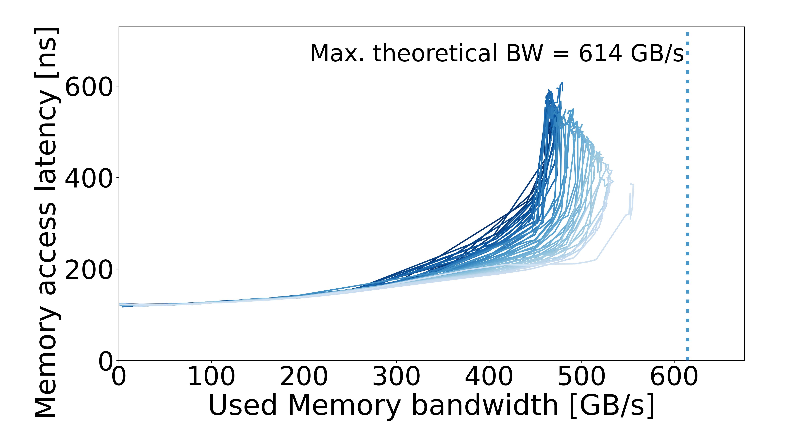

# Intel GNR — Xeon 6980P

## System specs

| Field | Value |
| --- | --- |
| Processor | Intel GNR — Xeon 6980P |
| Sockets / cores per socket | 2 / 128 |
| Archived CPU frequency | 3.2 GHz |
| Memory | DDR5 MRDIMM / DDR5 RDIMM |
| Plotter memory rate | 8800 MT/s / 6400 MT/s |
| OS / kernel | Not recorded |

Archived CPU frequencies come from the machine description.

## Configurations

| Configuration | Results |
| --- | --- |
| [MRDIMM](MRDRIMMS/README.md) | 1 configuration |
| [RDIMM](RDIMMS/README.md) | 2 configurations |

## Curves

| Configuration | Configuration | Configuration |
| :---: | :---: | :---: |
| **MRDIMM / AVX2**  | **RDIMM / AVX2**  | **RDIMM / AVX512**  |
