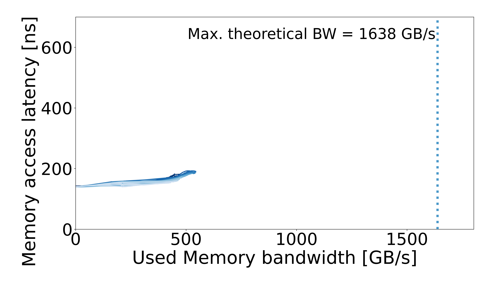

# Jülich — Intel Xeon Max 9462 — HBM

[System overview](../../README.md) · [All systems](../../../../README.md)

## Recorded machine specs

| Field | Value |
| --- | --- |
| Machine / processor | Jülich — Intel Xeon Max 9462 |
| Archived CPU frequency | 2.7 GHz |
| Microarchitecture | Sapphire Rapids HBM |
| Sockets / cores per socket | 2 / 32 |
| Memory target | HBM2 |
| Access pattern | Multisequential |
| Configuration | HBM |
| Plotter memory rate | 3200 MT/s |
| Plotter memory layout | 4 channels × 1024 bits |
| Plotter CPU reference | 2.761754 GHz |
| OS / kernel | Not recorded |

Specs reflect the archived machine description and run inputs.

## Curve

[Files and downloads](processed/README.md)
