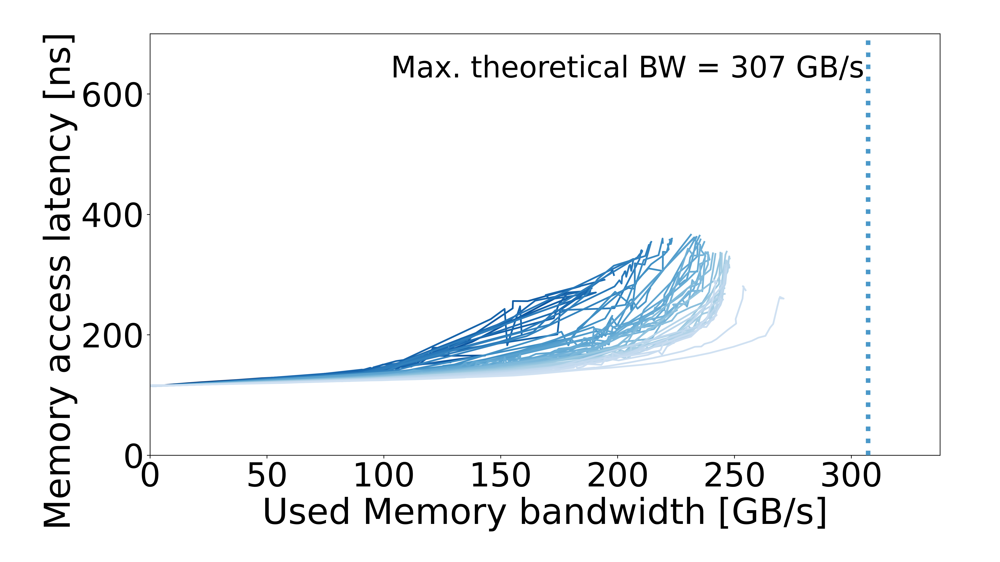

# Intel Xeon Max 9462

Processor: **Jülich — Intel Xeon Max 9462**. Machine specs are documented in the configuration pages below.

| Configuration | Results |
| --- | --- |
| [DDR5](DDR5/README.md) | 1 configuration |
| [HBM](HBM/README.md) | 1 configuration |

## Curves

| Configuration | Configuration | Configuration |
| :---: | :---: | :---: |
| **DDR5**  | **HBM**  |  |
