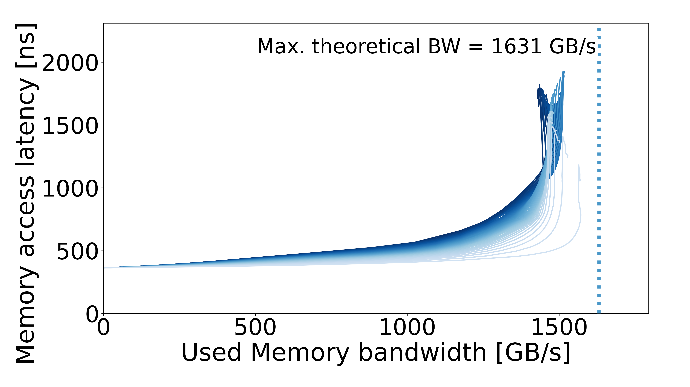

# MN5 ACC — NVIDIA H100

[All systems](../../../../README.md)

## Recorded machine specs

| Field | Value |
| --- | --- |
| Machine / processor | MN5 ACC — NVIDIA H100 |
| Access pattern | Multisequential |
| Configuration | Default |
| Plotter memory rate | 1593.000000 MT/s |
| Plotter memory layout | 2 channels × 4096 bits |
| Recorded GPU configuration | 132 SMs; 1593 MHz memory clock; 4096-bit bus |
| OS / kernel | Not recorded |

Specs reflect the archived machine description and run inputs.

## Curve

[Files and downloads](processed/README.md)
