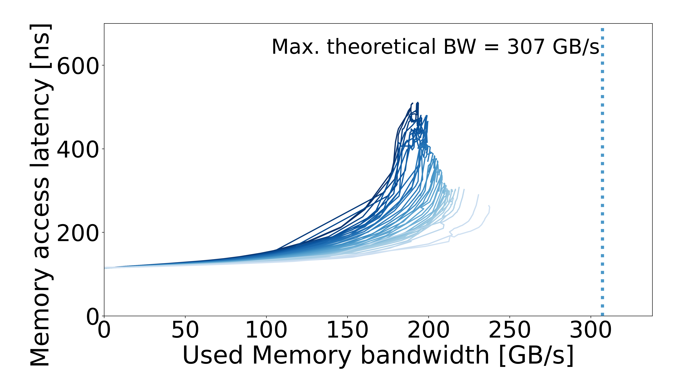
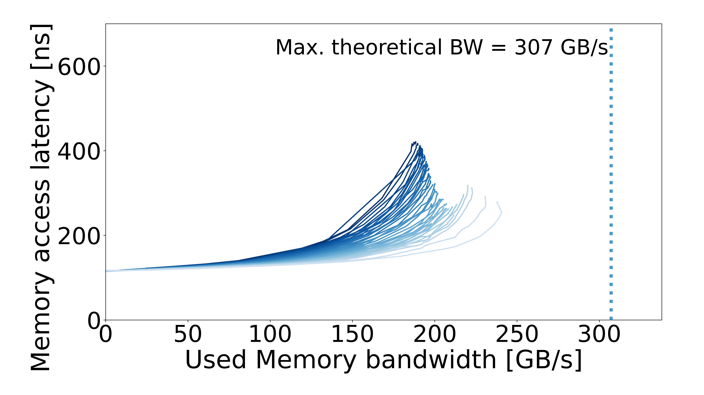
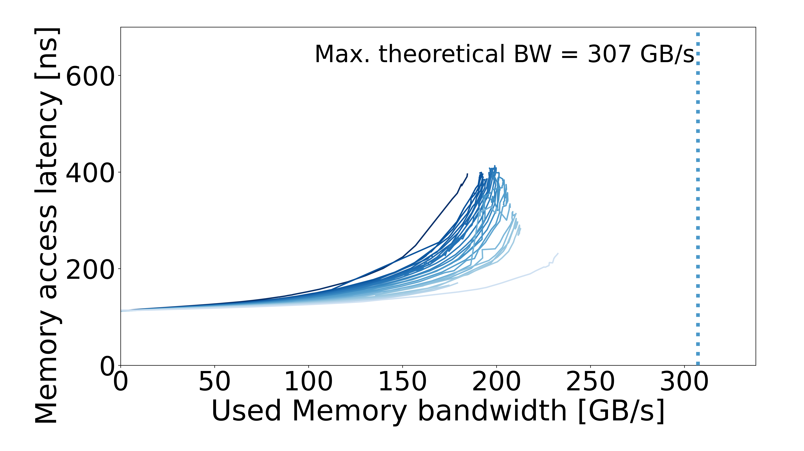
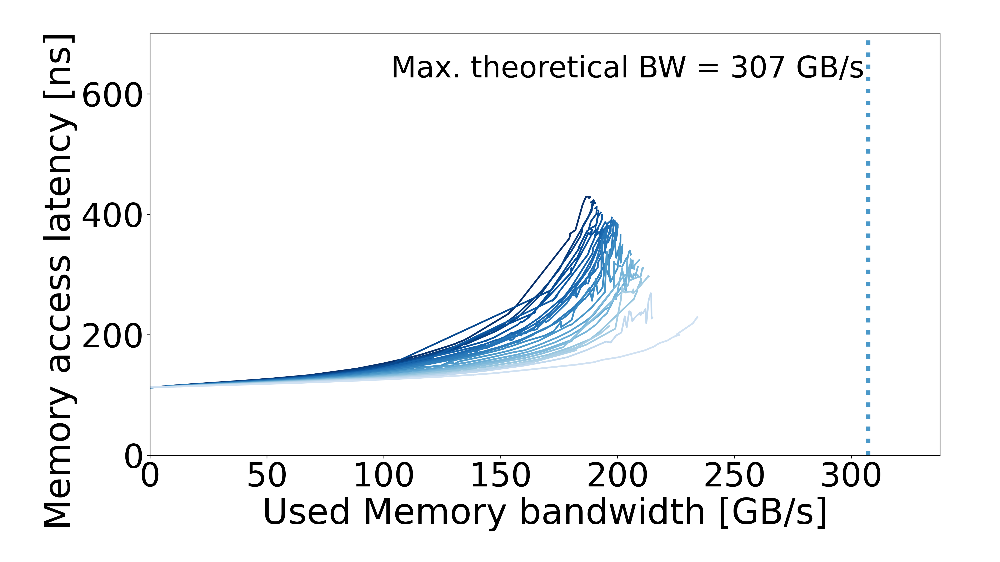

# MN5 GPP — regular memory

Processor: **MN5 GPP — Intel Xeon Platinum 8480+**. Machine specs are documented in the configuration pages below.

| Configuration | Results |
| --- | --- |
| [AVX2](AVX2/README.md) | 1 configuration |
| [AVX512](AVX512/README.md) | 1 configuration |
| [SCALAR](SCALAR/README.md) | 1 configuration |
| [SSE](SSE/README.md) | 1 configuration |

## Curves

| Configuration | Configuration | Configuration |
| :---: | :---: | :---: |
| **regular / AVX2**  | **regular / AVX512**  | **regular / SCALAR**  |
| **regular / SSE**  |  |  |
