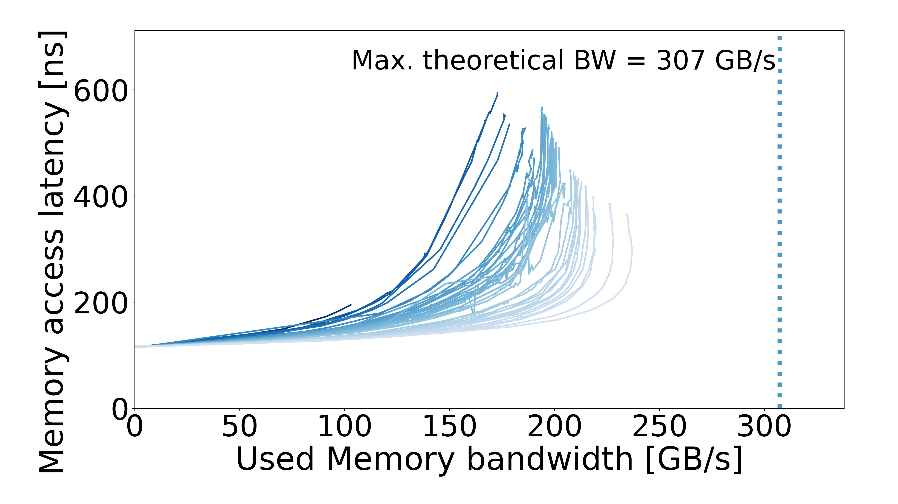
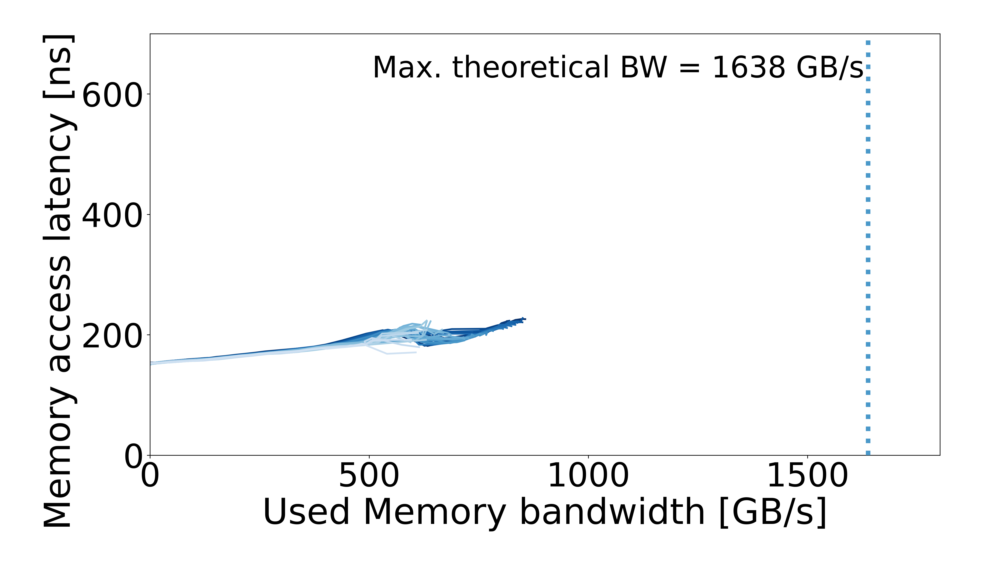

# MN5 HBM — Intel Xeon Max 9480

## System specs

| Field | Value |
| --- | --- |
| Processor | MN5 HBM — Intel Xeon Max 9480 |
| Cores per socket | 56 |
| Archived CPU frequency | 2 GHz |
| Memory | DDR5; HBM2 |
| Plotter memory rate | 4800 MT/s / 3200 MT/s |
| OS / kernel | Not recorded |

Archived CPU frequencies come from the machine description.

## Configurations

| Configuration | Results |
| --- | --- |
| [DDR5](DDR5/README.md) | 1 configuration |
| [HBM](HBM/README.md) | 1 configuration |
| [SNC](SNC/README.md) | 1 configuration |

## Curves

| DDR5 | SNC / DDR5 | HBM |
| :---: | :---: | :---: |
|  |  |  |
