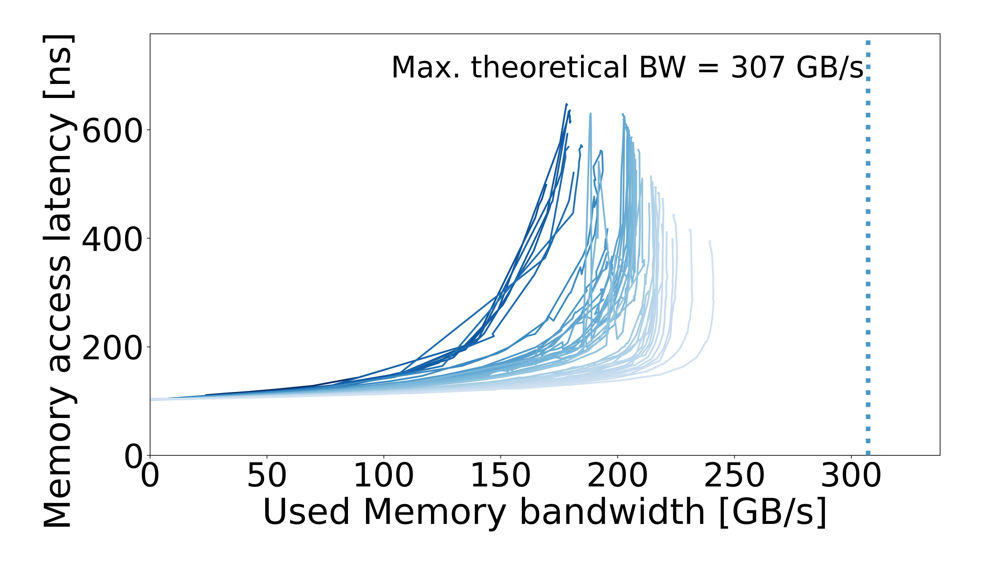

# MN5 HBM — Intel Xeon Max 9480 — SNC / DDR5

[System overview](../../README.md) · [All systems](../../../../../README.md)

## Recorded machine specs

| Field | Value |
| --- | --- |
| Machine / processor | MN5 HBM — Intel Xeon Max 9480 |
| Archived CPU frequency | 2 GHz |
| Microarchitecture | Sapphire Rapids HBM |
| Cores per socket | 56 |
| Memory target | DDR5 |
| Access pattern | Multisequential |
| Configuration | SNC / DDR5 |
| Plotter memory rate | 4800 MT/s |
| Plotter memory layout | 8 channels × 64 bits |
| Plotter CPU reference | 2.562756 GHz |
| OS / kernel | Not recorded |

Specs reflect the archived machine description and run inputs.

## Curve

[Files and downloads](processed/README.md)
