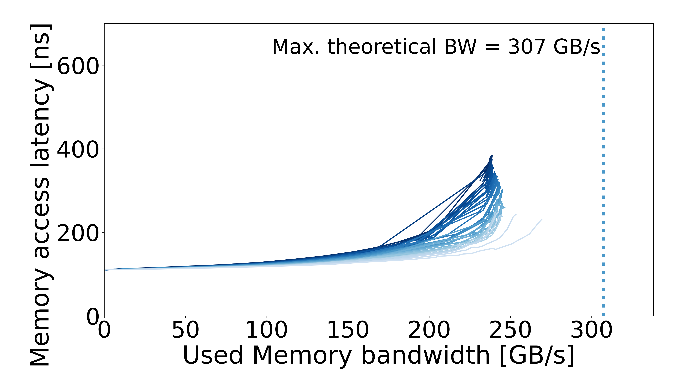
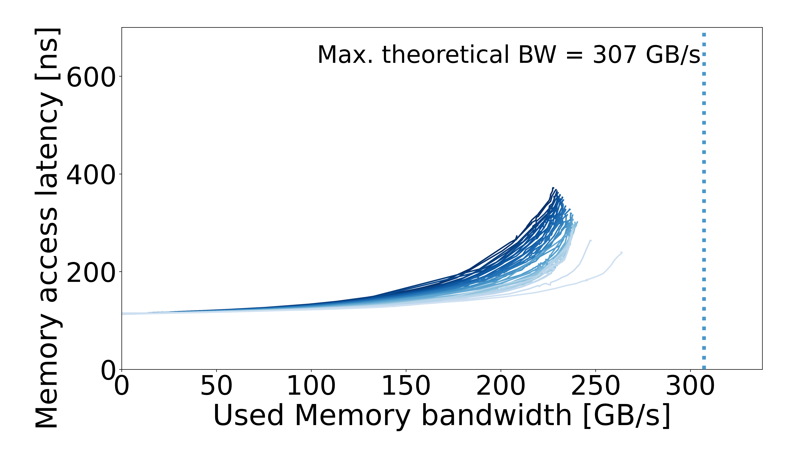

# MareNostrum 5

| System / configuration | Results |
| --- | --- |
| [MN5-ACC](MN5-ACC/README.md) | 2 configurations |
| [MN5 GPP — Intel Xeon Platinum 8480+](MN5-GPP/README.md) | 8 configurations |
| [MN5 HBM — Intel Xeon Max 9480](MN5-HBM/README.md) | 3 configurations |

## Curves

| MN5 ACC — Intel Xeon Platinum 8460Y+ | MN5 ACC — NVIDIA H100 | MN5 GPP — Intel Xeon Platinum 8480+ |
| :---: | :---: | :---: |
|  |  |  |

| MN5 GPP — Intel Xeon Platinum 8480+ | MN5 GPP — Intel Xeon Platinum 8480+ |
| :---: | :---: |
|  |  |

| MN5 GPP — Intel Xeon Platinum 8480+ | MN5 GPP — Intel Xeon Platinum 8480+ |
| :---: | :---: |
|  |  |

| MN5 GPP — Intel Xeon Platinum 8480+ | MN5 GPP — Intel Xeon Platinum 8480+ |
| :---: | :---: |
|  |  |

| MN5 GPP — Intel Xeon Platinum 8480+ | MN5 HBM — Intel Xeon Max 9480 |
| :---: | :---: |
|  |  |

| MN5 HBM — Intel Xeon Max 9480 | MN5 HBM — Intel Xeon Max 9480 |
| :---: | :---: |
|  |  |
