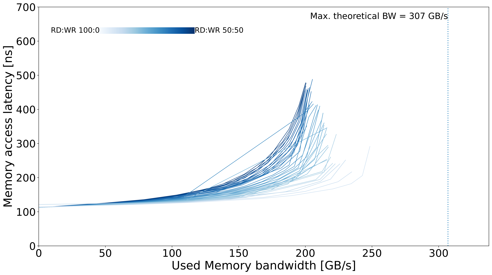
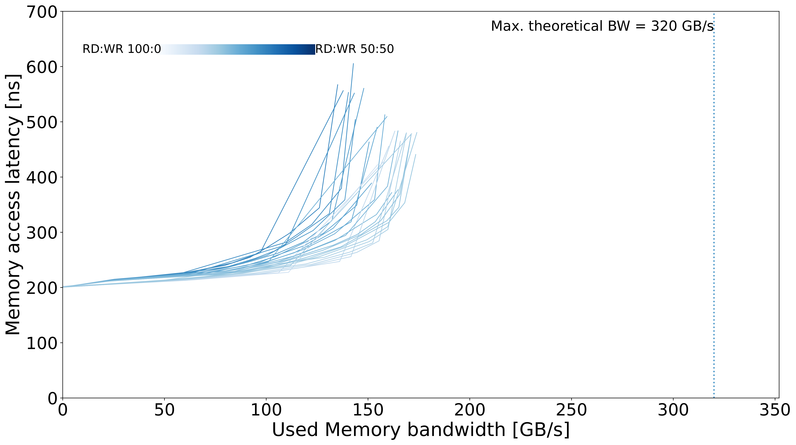

# Micron server - DDR5

## System Overview

| Model | µArch | Sockets | Cores / Socket | Frequency (GHz) | Type | Freq (MT/s) | Channels / Socket |
| --- | --- | --- | --- | --- | --- | --- | --- |
| Intel Xeon Platinum 8568CXL | Emerald rapids | 2 | 48 | 2 | DDR5 | 4800 | 8 |

## Memory Performance

### Local Memory

#### Prefetcher On

| Curve |
| --- |
|  |

### Remote Memory

#### Prefetcher On

| Curve |
| --- |
|  |

