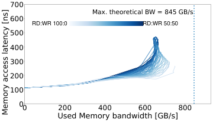

# IntelServer

## System Overview

| Model | µArch | Sockets | Cores / Socket | Frequency (GHz) | Type | Freq (MT/s) | Channels / Socket |
| --- | --- | --- | --- | --- | --- | --- | --- |
| Intel Xeon 6980P | Granite Rapids | 2 | 128 | 3.2 | DDR5-RDIMM | 6400 | 12 |
| Intel Xeon 6980P | Granite Rapids | 2 | 128 | 3.2 | DDR5-MRDIMM | 8800 | 12 |

## Memory Performance · MRDIMM

### Local Memory

| Curve |
| --- |
|  |

### Remote Memory

No remote memory available for this server
