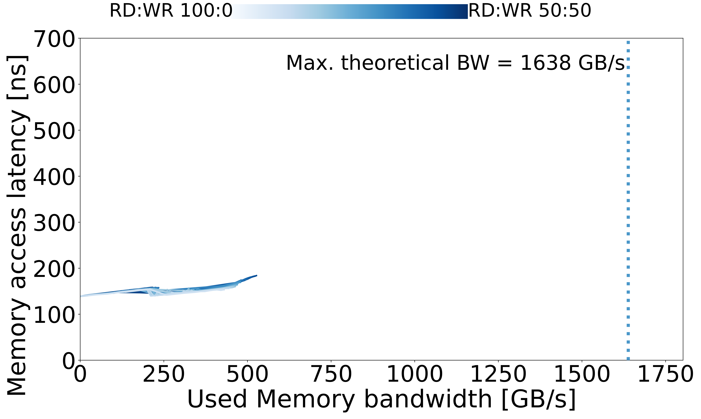

# Julich - IntelMax

## System Overview

| Model | µArch | Sockets | Cores / Socket | Frequency (GHz) | Type | Freq (MT/s) | Channels / Socket |
| --- | --- | --- | --- | --- | --- | --- | --- |
| Intel® Xeon® CPU Max 9462 32C | Sapphire RapidsHBM  | 2 | 32 | 2.7 | HBM2 | 3200 | 4|
## Memory Performance

### Local Memory

| Curve |
| --- |
|  |
