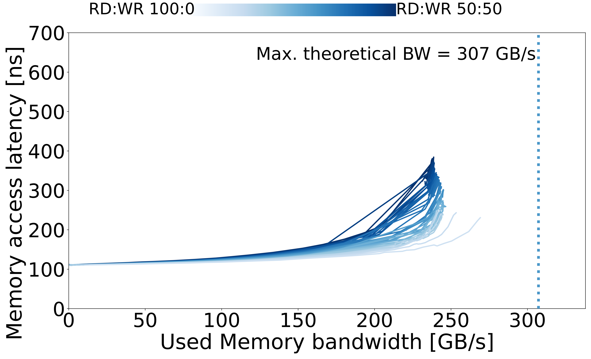
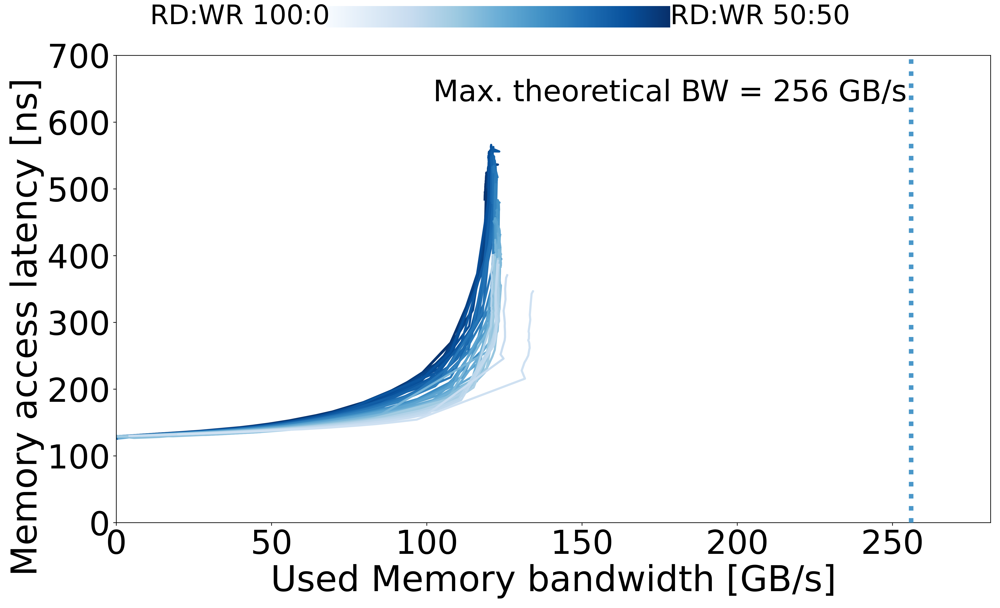

# MareNostrum 5 - ACC

## System Overview

| Model | µArch | Sockets | Cores / Socket | Frequency (GHz) | Type | Freq (MT/s) | Channels / Socket |
| --- | --- | --- | --- | --- | --- | --- | --- |
| Intel Xeon Platinum 8460Y+ | Sapphire Rapids | 2 | 40: | 2 | DDR5 | 4800 | 8 |

## Memory Performance

### Local Memory

| Curve |
| --- |
|  |

### Remote Memory

| Curve |
| --- |
|  |
