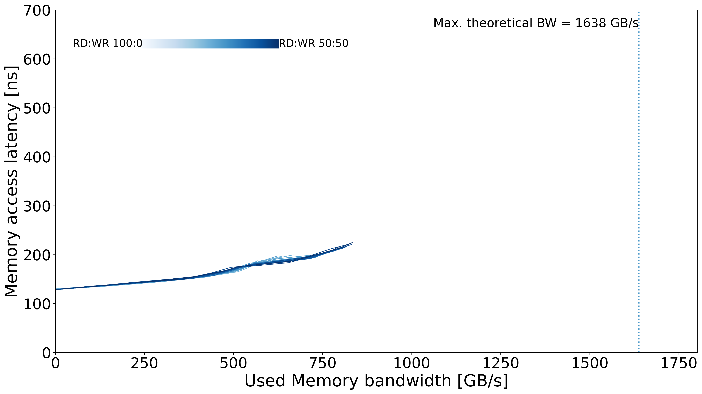

# MareNostrum 5 - GPP HBM

## System Overview

| Model | µArch | Sockets | Cores / Socket | Frequency (GHz) | Type | Freq (MT/s) | Channels / Socket |
| --- | --- | --- | --- | --- | --- | --- | --- |
| Intel Xeon Max 9480 | Sapphire RapidsHBM | 1.9 | 56 | 2 | HBM2 | 3200 | 4 |

## Memory Performance

### Local Memory
| Memory Curve |
| --- |
|  |
